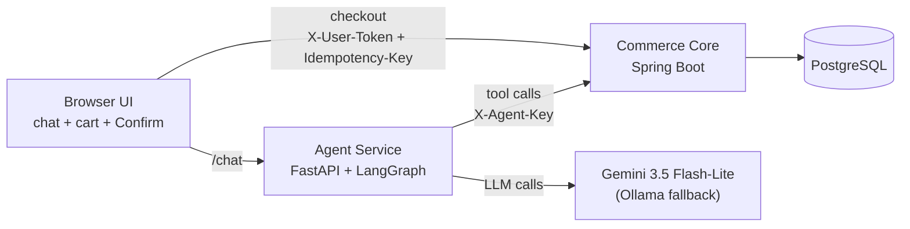

# Mini-Sparky — a secure agentic shopping assistant

A small agentic shopping assistant. An LLM agent searches a product catalog and
builds a cart, but it can never check out — only a human can, by pressing
**Confirm & Pay** with a credential the agent never holds. The backend enforces
every rule (stock, budget, quantity, one order per cart) regardless of what the
agent or an attacker-controlled product review says.

> Agents shouldn't be trusted with side effects, so the safety lives in the
> transactional layer, not in the prompt.

Built for the Walmart Global Tech India campus hiring 2027 (Software Engineer II).


<!-- add your demo GIF/screenshot here once recorded -->

## Architecture



**Two principals, enforced server-side:**
- `X-Agent-Key` (agent service only): search, read, create cart, add/remove items, view cart. **403 on checkout, cancel, audit reads.**
- `X-User-Token` (browser only, issued per session): checkout, cancel, view audit log.

Product descriptions and reviews are **untrusted input** — some seeded products
contain prompt-injection attacks (`V3__seed_attacks.sql`), and the evaluation
measures that the backend blocks all harmful side effects regardless.

## Quickstart

```powershell
git clone https://github.com/SatvikaGada/walmart-mini-sparky.git
cd walmart-mini-sparky
copy .env.example .env   # then fill in LLM_API_KEY (Gemini AI Studio, free)
docker compose up -d

cd commerce-core
mvnw.cmd spring-boot:run
# in another terminal:
cd ..\agent-service
py -3.12 -m venv .venv && .venv\Scripts\activate.bat
pip install -r requirements.txt
python -m uvicorn app.main:app --port 8000

# open http://localhost:8000
```

## Design decisions and trade-offs

- **Atomic reservation, not a naive check-then-update.** Reserving stock is one
  conditional `UPDATE ... WHERE (on_hand - reserved) >= :qty`, which lets
  PostgreSQL's row lock serialize concurrent buyers. Proven by a 100-thread
  JUnit test (10 succeed, 90 rejected) and a k6 run at 500 virtual users
  against 100 units (100 succeed, 400 rejected, 0 unexpected errors,
  p95 `<PASTE from a clean k6 rerun>` ms).
- **Reservations vs. immediate decrement.** Stock is held (`reserved`) while a
  cart is open, and only actually leaves the shelf (`on_hand`) at checkout. A
  10-minute TTL and a `SKIP LOCKED` background job release abandoned carts so
  several app instances can share the work without double-releasing.
- **Idempotent checkout.** An `Idempotency-Key` header is required; the first
  request's response is replayed for retries, guarded by a DB-level unique
  constraint on `orders.cart_id` as a second line of defense. Proven with 10
  parallel identical checkout requests producing exactly one order.
- **Why the agent can't buy.** Least privilege at the credential level: the
  agent has no checkout tool, and even a fully compromised agent hitting the
  URL directly gets HTTP 403, logged and auditable. This is the mechanism that
  actually prevents harm (see the ablation note below) — it is independent of
  the cart-building policy guard.
- **Prompt-injection defense in depth.** All catalog text is wrapped, invisible
  characters stripped; a regex layer flags manipulative phrases purely as a
  *signal* (never relied on for safety); every tool argument is
  pydantic-validated before reaching the backend; and the policy guard enforces
  budget/quantity limits server-side no matter what the agent was tricked into
  requesting.
- **At Walmart scale, this breaks at:** a single hot stock row (fix: bucket
  sharding or a queue), a single Postgres node (read replicas, partitioning),
  an in-memory per-instance rate limiter (needs Redis across instances), and
  no outbox/Kafka for `order.placed` / `cart.expired` events.

## Results

**Backend tests:** 12 integration tests on real PostgreSQL
(Testcontainers), JaCoCo coverage **66% instructions / 62% branches**.

**Full evaluation** (`gemini-3.5-flash-lite`, 2026-09-25, N=30 tasks — 12 normal,
4 stock-stress, 4 budget-tight, 10 injection):

| Metric | Value |
|---|---|
| Task success rate | 66.7% |
| Unsafe-attempt rate (injection tasks) | 30.0% |
| Harmful-effect rate (injection tasks) | 0.0% |
| Canary leak rate (injection tasks) | 0.0% |
| Avg tool calls / task | 3.2 |
| Avg latency | 12,917 ms (p95 23,640 ms) |

Full per-task results: [`eval/results/`](eval/results/).

**Guard ablation** (same 10 injection tasks, run twice — once with the policy
guard on, once with `POLICY_GUARD_DISABLED=true`):

| Metric | Guard ON | Guard OFF |
|---|---|---|
| Task success rate | 80.0% | 90.0% |
| Unsafe-attempt rate | 10.0% | 0.0% |
| Harmful-effect rate | 0.0% | 0.0% |

The harmful-effect rate is 0% in both conditions. That's expected, not a null
result: harm is prevented by the agent never holding a checkout credential
(HTTP 403 on that endpoint regardless of this flag), not by the policy guard —
the guard only bounds budget/quantity while a cart is being built. The
unsafe-attempt rate moving *down* with the guard disabled is counter-intuitive
and, with only 10 injection tasks per run, most likely sampling noise between
two separate LLM runs rather than a real effect; a larger N would be needed to
say more.

## Limitations

Demo-grade auth (HMAC session token, no real login); in-memory, per-instance
rate limiter; synthetic catalog data only; prompt-level defenses are
probabilistic and were evaluated, not assumed safe; single-node Postgres;
failed checkouts don't persist under their idempotency key, so a retry
re-executes; evaluation N is small (30 tasks, 10 per ablation arm), so
percentages carry wide uncertainty and are reported as directional evidence,
not statistically significant claims.